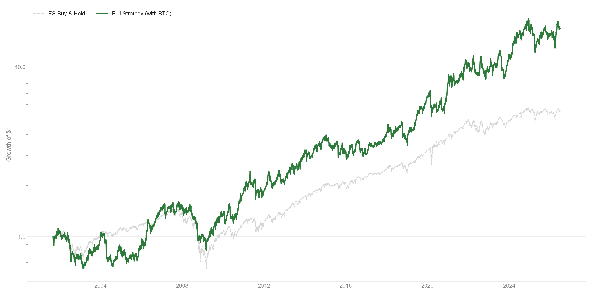
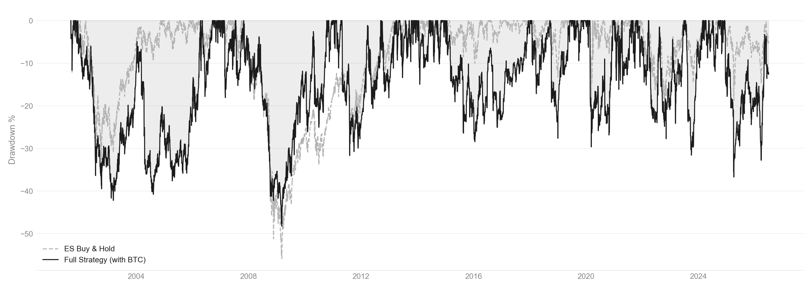
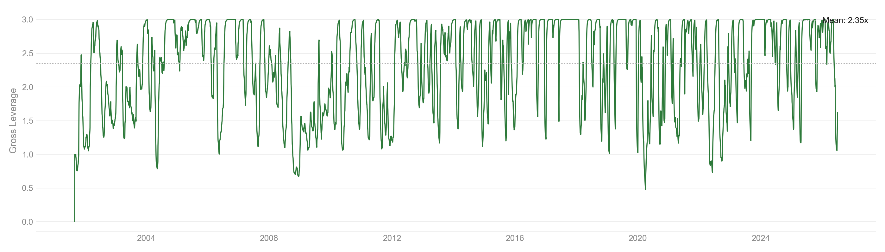
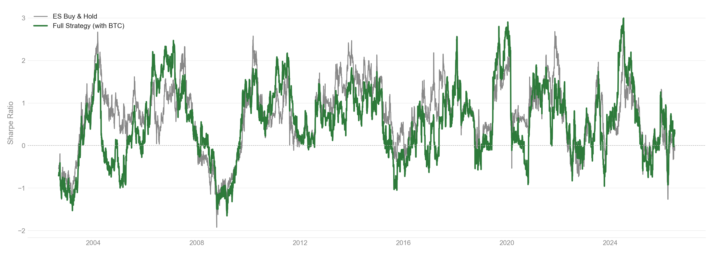
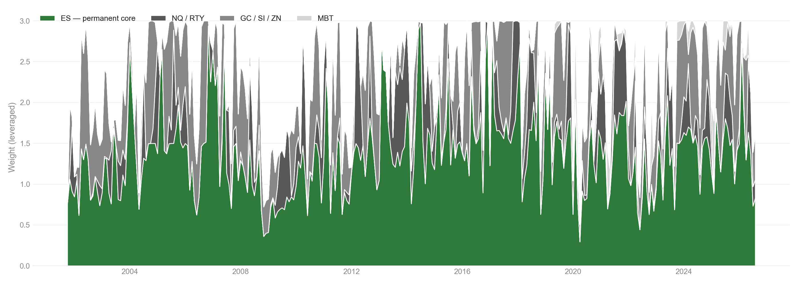
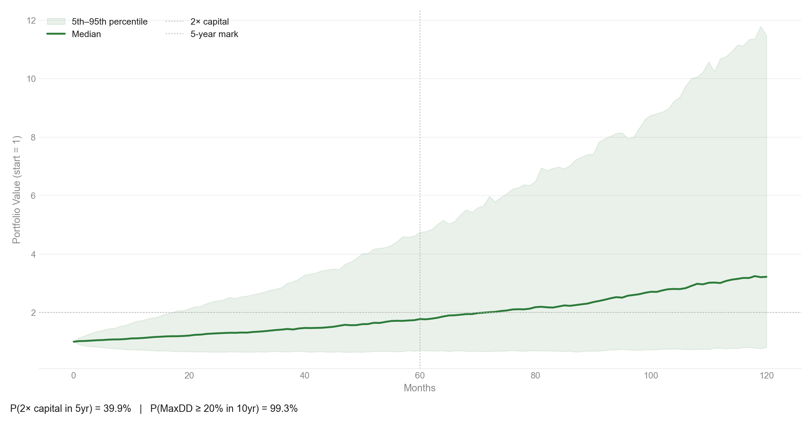

The core research strategy. U.S. large-cap equity futures as a permanent
allocation with dynamic exposure to eight alternatives across equities,
fixed income, real assets, and digital assets — the logic every Dog Capital
program is built from.

<a href="../index.qmd#programs" class="back-link">← Back</a>

---

## Instrument Universe

The strategy trades seven futures contracts: ES (S&P 500), NQ (Nasdaq-100),
RTY (Russell 2000), GC (Gold), SI (Silver), ZN (10-year Treasury), and MBT
(Micro Bitcoin). All are USD-denominated and trade on regulated U.S. exchanges.

ES is the permanent core. U.S. large-cap equity has been the most reliably
positive long-run risk premium available to investors. Every alternative is
evaluated against ES on a risk-adjusted basis. The permanent equity core
ensures the strategy participates in the growth regime that historically
accounts for the majority of compounded long-run return.

---

## Strategy Design

ES Core maintains a permanent allocation to ES and dynamically allocates
up to 50% of the portfolio to the six alternative instruments based on their
risk-adjusted performance relative to ES.

**Framework:**

- Permanent core: ES with hard floor at 50%
- Tactical sleeve: inverse downside semi-deviation weighted
- Sleeve qualification: rolling Sortino vs ES > 0
- Volatility target: 10–28% downside semi-deviation
- Leverage: dynamic, max 3.0x
- EMA(10) smoothing + 10% no-trade band
- Signal lag: 1 day

Leverage is structurally necessary. The volatility targeting mechanism
determines how much notional exposure each dollar of capital should support.
In high-conviction, low-volatility environments the strategy runs above 1x
notional leverage. In uncertain or high-volatility environments it contracts
toward or below 1x. Sizing decisions are systematic — no discretionary
overrides, no forecasting of direction.

---

## Instrument Rationale

**ES — permanent equity core.** The primary long-run growth engine.
Every allocation decision is measured against it.

**NQ / RTY — equity beta diversification.** Different segments of the
U.S. equity risk premium, qualified into the tactical sleeve only when
their risk-adjusted profile improves on ES.

**GC / SI — real-asset hedge.** Exposure that tends to hold up when
paper assets don't, particularly in inflationary or currency-stress regimes.

**ZN — duration hedge.** A rates exposure that diversifies the portfolio's
sensitivity to growth versus rate-driven regimes.

**MBT — asymmetric convexity.** A small, disciplined sleeve for a return
distribution with meaningfully different tail behavior than the rest of
the book.

---

## Backtest Results

> **These are hypothetical backtested results.** They were not achieved by
> any investor. Past hypothetical performance is not a reliable indicator
> of future results.

Single continuous run from 2001-09-01 (2001-09-04 first trading day) through
2026-07-03 — the same start date used across every Dog Capital program,
chosen to begin just after the dot-com peak's collapse rather than a
friendlier window. ES/NQ/GC/SI/ZN data begins 2001-01-02; RTY joins
2017-07-10; the digital-asset sleeve's price series (BTC-USD) joins
2017-12-18. Before inception an instrument earns zero return → zero vol →
disqualified from the tactical sleeve automatically. Signals lag execution
by one day — no lookahead.

Every trade costs $5 commission per round-turn contract plus 1 tick of
slippage per side, priced at each instrument's real tick value. The
digital-asset sleeve is priced via BTC-USD spot for a longer continuous
history than its actual futures contract provides, but costed and margined
using that contract's real economics (Micro Bitcoin futures, CME — 0.1
BTC/contract, $0.50/tick), gated open from December 2017 (CME's Bitcoin
futures market debut) rather than Micro Bitcoin's own 2021 listing. Price
data is sourced from yfinance continuous futures and spot series; a Norgate
Data upgrade for cleaner futures-roll methodology is tracked in the
backlog. $1,000,000 initial capital, no contributions.

| Metric | ES Buy & Hold | Full Strategy |
|--------|:-------------:|:-------------:|
| Total Return | 446.9% | 1,587.7% |
| CAGR | 5.78% | 9.80% |
| Ann. Volatility | 16.03% | 24.50% |
| Sharpe Ratio | 0.431 | 0.505 |
| Sortino Ratio | 0.435 | 0.483 |
| Calmar Ratio | 0.104 | 0.203 |
| Max Drawdown | -55.85% | -48.26% |
| CVaR 95% | -2.50% | -3.97% |
| CVaR 99% | -4.27% | -6.53% |
| Tail Ratio | 0.950 | 0.979 |
| Skewness | 0.275 | -0.691 |
| Kurtosis | 18.238 | 5.904 |
| Avg Leverage | 1.00x | 2.35x |

---

## Equity Curve

---

## Drawdown

---

## Leverage

---

## Rolling Sharpe

---

## Weight Allocation

---

## Monte Carlo

1,000 bootstrapped paths over a 10-year horizon, resampled monthly from
the historical backtest return distribution.

P(2x capital in 5yr) = **39.9%** &nbsp;|&nbsp; P(MaxDD ≥ 20% in 10yr) = **99.3%**

---

## Execution Layer

ES Core is the research core the rest of Dog Capital's programs are built
from — every live and paper strategy in the lineup, including ETF Core,
inherits its allocation logic. Direct futures execution at this scale
requires substantial dedicated capital, so the strategy proves itself first
on IBKR paper trading ahead of live deployment.

---

> **Disclaimer.** These are hypothetical backtested results. They were not
> achieved by any investor. Hypothetical performance does not reflect the
> impact of taxes, brokerage fees, slippage, or the inability to execute
> at historical prices. Past hypothetical performance is not a reliable
> indicator of future results. This is not investment advice.

---

*© 2026 Dog Capital*
