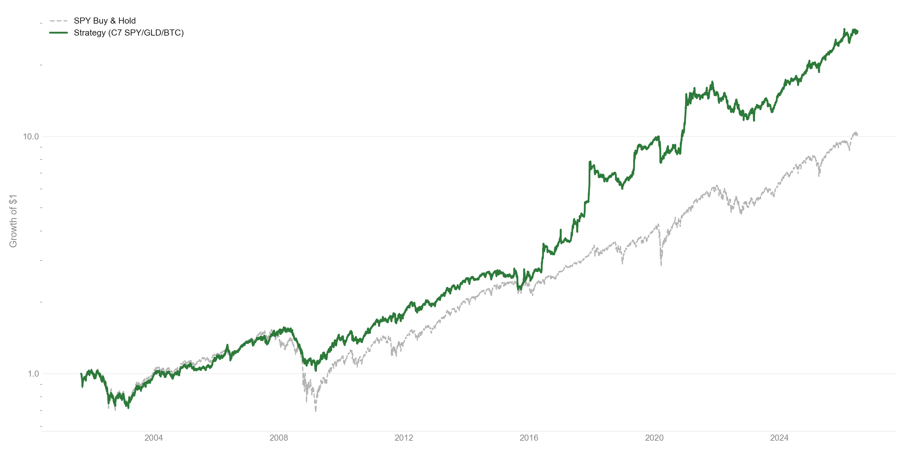
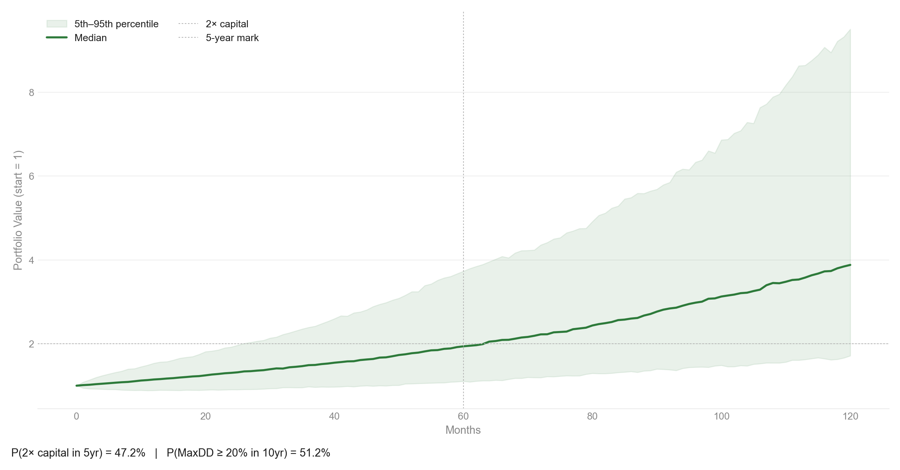

U.S. and global ETFs as a permanent equity core with dynamic vol-targeted
allocation to growth, real assets, and digital assets — executed as CEDEARs
on the Argentine market.

<a href="../index.qmd#programs" class="back-link">← Back</a>

---

## Why Not Just Pick Stocks

Active stock-picking underperforms in aggregate. The evidence is consistent
across decades and geographies: after fees, most active managers trail a
simple market-cap-weighted index. The reason is structural — markets price
information quickly, and the skill required to exploit the remaining
inefficiencies consistently exceeds what most participants can sustain.

The Efficient Market Hypothesis does not say prices are always right.
It says that finding and trading on mispricings reliably enough to
outperform, net of costs, is extremely hard. The empirical record confirms
this. SPIVA data shows that over 15-year horizons, 88%+ of US active
large-cap funds underperform the S&P 500.

The rational baseline is a diversified passive position. The question is
not whether to own the index, but how to size exposure dynamically as
risk changes over time.

---

## Vol Targeting Framework

Static leverage amplifies both returns and drawdowns equally. A strategy
that targets a constant level of realized portfolio volatility — scaling
exposure up in calm periods and reducing it in turbulent ones — produces
a better risk-adjusted outcome without requiring any directional forecast.

This is not market timing. The signal is realized volatility, not
expected returns. The strategy does not predict where prices will go;
it adjusts how much risk is held as the risk environment changes.

**Framework:**

- Permanent core: SPY with hard floor at 50%
- Tactical sleeve: GLD / IBIT (inverse downside semi-deviation weighted)
- Sleeve qualification: rolling Sortino vs SPY > 0 over 63-day window
- Vol target: 10–20% annualized downside semi-deviation
- Leverage: max 1.0x (spot ETFs — no derivatives, no margin)
- EMA(10) smoothing on leverage signal
- 10% no-trade band to suppress noise-driven turnover
- Reduce-only intra-month trigger if realized vol exceeds 20%

The downside semi-deviation captures only the left tail — it penalizes
negative deviations from zero, not all volatility. This is the correct
risk measure for a strategy targeting drawdown control rather than
volatility symmetry.

---

## Instrument Rationale

**SPY — US broad market core.**
The S&P 500 is the most liquid, cheapest-to-hold expression of the US
equity risk premium. Hard floor at 50% ensures the strategy always
participates in the primary growth engine.

**GLD — Hard asset hedge.**
Gold is not correlated with equity returns over long horizons. It earns
positive real returns in inflationary and currency-crisis regimes — precisely
the periods when equities and bonds both suffer. The correlation benefit
is most valuable in the tail, when diversification is needed most.

**IBIT (BTC-USD in backtest) — Non-sovereign asymmetric.**
Bitcoin's return distribution has positive skewness and near-zero
correlation with equities. At a small portfolio weight it adds right-tail
optionality without proportionally increasing portfolio volatility.
Executed via IBIT CEDEARs (10:1 ratio) on the Argentine market.
In the backtest, BTC-USD is used for longer history — IBIT data begins January 2024.

---

## Backtest Results — C7 vs SPY Buy-and-Hold

Single continuous run from 2001-09-04 through 2026-07-02. Assets join when
data becomes available: SPY from 2001-09-04, GLD from 2004-11-18, BTC-USD
from 2014-09-17. Before inception an asset earns zero return → zero vol →
disqualified from the tactical sleeve automatically. No in-sample / out-of-sample
split. $10,000 initial capital, zero contributions. 0.50% transaction cost on
traded notional.

| | CAGR | Sharpe | Sortino | Calmar | MaxDD | CVaR95 | CVaR99 | TailRatio | Skew | Kurt |
|--|:--:|:--:|:--:|:--:|:--:|:--:|:--:|:--:|:--:|:--:|
| **Strategy** | **+11.68%** | **0.810** | **0.796** | **0.338** | **-34.57%** | **-2.21%** | **-3.70%** | **1.008** | 0.179 | 16.41 |
| SPY buy-and-hold | +8.06% | 0.536 | 0.461 | 0.146 | -55.19% | -2.68% | -4.63% | 0.941 | 0.046 | 16.94 |

*Strategy outperforms SPY B&H on every metric. MaxDD -21pp better (strategy -34.6% vs SPY -55.2%). Calmar 2.3x better.*

*Log scale, normalised to 1 at 2001-09-04. Weekly rebalance, no contributions.*

---

## Monte Carlo

1,000 bootstrapped paths over a 10-year horizon, resampled monthly from
the historical backtest return distribution — the C7 configuration actually
offered.

P(2x capital in 5yr) = **47.2%** &nbsp;|&nbsp; P(MaxDD ≥ 20% in 10yr) = **51.2%**

---

## Execution Layer

Signal generation and sizing run monthly, on the last trading day of the
month. Execution on IOL is automated end-to-end — no manual confirmation
step for scheduled runs.

Live broker: IOL (Invertir Online) — real, funded account, auto-execution
built and live since July 2026.
Balanz: legacy manual execution via a Telegram-driven flow, winding down.

Intra-month vol breach: an automated REDUCE check runs if realized
portfolio vol exceeds 20%.

---

> **Disclaimer.** These are hypothetical backtested results. They were not
> achieved by any investor. Hypothetical performance does not reflect the
> impact of taxes, brokerage fees, slippage, or the inability to execute
> at historical prices. Past hypothetical performance is not a reliable
> indicator of future results. This is not investment advice.

---

*© 2026 Dog Capital*
